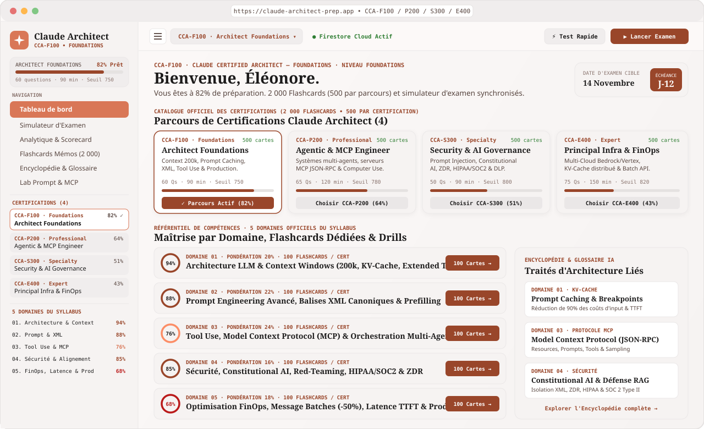

<div align="center">

# 🏛️ Claude Certified Architect — Academic Atelier

### **Plateforme Officielle d'Entraînement, de Simulation d'Examen & d'Encyclopédie Technique**

[](#🎓-les-4-parcours-de-certifications-claude-architect)
[-d97757?style=for-the-badge)](#🗂️-banque-de-2-000-flashcards-connectées)
[](#🧭-les-5-domaines-officiels-du-syllabus)
[](#☁️-persistance-cloud-firebase--sécurité)
[](#🛠️-stack-technique--architecture)

<br />



*Aperçu de l'interface **Academic Atelier** : sélecteur des 4 parcours de certifications, jauges des 5 domaines officiels du syllabus, accès direct aux 2 000 Flashcards et synchronisation Cloud Firestore.*

</div>

---

## 📖 Sommaire

- [✨ Présentation Générale](#-présentation-générale)
- [🎓 Les 4 Parcours de Certifications Claude Architect](#-les-4-parcours-de-certifications-claude-architect)
- [🧭 Les 5 Domaines Officiels du Syllabus](#-les-5-domaines-officiels-du-syllabus)
- [🗂️ Banque de 2 000 Flashcards Connectées](#️-banque-de-2-000-flashcards-connectées)
- [🧩 Modules Fonctionnels de la Plateforme](#-modules-fonctionnels-de-la-plateforme)
- [☁️ Persistance Cloud Firebase & Sécurité](#️-persistance-cloud-firebase--sécurité)
- [🛠️ Stack Technique & Architecture](#️-stack-technique--architecture)
- [🚀 Installation & Démarrage Rapide](#-installation--démarrage-rapide)

---

## ✨ Présentation Générale

**Claude Certified Architect — Academic Atelier** est un environnement complet de préparation aux certifications d'architecture LLM et de systèmes agentiques. Conçue selon une esthétique éditoriale chaleureuse (*Warm Ivory Paper*, *Terracotta* et typographies *Newsreader* / *JetBrains Mono*), la plateforme réunit dans une interface unifiée :

- 🎯 **4 Parcours de Certifications** du niveau *Foundations* au niveau *Principal Expert*.
- 🧭 **5 Domaines Officiels du Syllabus** avec pondérations dynamiques selon la certification choisie.
- 🗂️ **2 000 Flashcards techniques** (**500 cartes dédiées par certification**, soit **100 cartes par domaine**).
- ⏱️ **Simulateur d'Examen Chronométré** avec cas d'architecture réels, extraits de code, métriques SLA et correction détaillée.
- 📊 **Scorecard Analytique** permettant d'identifier les domaines prioritaires et de relancer des *Drills* ciblés.
- 📚 **Encyclopédie & Glossaire IA** directement reliés à chaque flashcard (traités d'architecture, schémas de code Python/TypeScript, pièges d'examen et bonnes pratiques).
- 🧪 **Laboratoire Interactif (Prompt, XML, Tool Use & MCP)** pour expérimenter les patterns de production.

---

## 🎓 Les 4 Parcours de Certifications Claude Architect

Chaque parcours adapte dynamiquement les pondérations des 5 domaines sur le **Tableau de bord**, dans le **Menu Hamburger / Barre latérale** et dans la **Banque de Flashcards** :

| Code | Intitulé de la Certification | Niveau | Format Épreuve | Seuil | Banque de Flashcards |
| :--- | :--- | :---: | :---: | :---: | :---: |
| 🥉 **`CCA-F100`** | **Claude Certified Architect — Foundations** | `Foundations` | 60 Qs • 90 min | `750 / 1000` | **500 Cartes** (`#1` à `#500`) |
| 🥈 **`CCA-P200`** | **Claude Certified Agentic Systems & MCP Engineer** | `Professional` | 65 Qs • 120 min | `780 / 1000` | **500 Cartes** (`#1001` à `#1500`) |
| 🛡️ **`CCA-S300`** | **Claude Certified Enterprise Security & AI Governance** | `Specialty` | 50 Qs • 90 min | `800 / 1000` | **500 Cartes** (`#2001` à `#2500`) |
| 🏆 **`CCA-E400`** | **Claude Certified Principal LLM Infrastructure & FinOps** | `Expert` | 75 Qs • 150 min | `820 / 1000` | **500 Cartes** (`#3001` à `#3500`) |

---

## 🧭 Les 5 Domaines Officiels du Syllabus

Les 5 domaines structurent l'ensemble des examens blancs, de l'encyclopédie et des flashcards, avec une pondération spécifique par parcours :

| Domaine | Intitulé Officiel | Sujets Clés du Référentiel | Poids `F100` | Poids `P200` | Poids `S300` | Poids `E400` |
| :---: | :--- | :--- | :---: | :---: | :---: | :---: |
| **01** | 🧠 **Architecture LLM & Context Windows** | Fenêtre 200k, benchmark NIAH, KV-Cache, Prompt Caching (4 breakpoints, TTL 5 min), Extended Thinking (`budget_tokens`), Vision & PDF natif. | **20%** | **15%** | **10%** | **30%** |
| **02** | ✍️ **Prompt Engineering Avancé & System Prompts** | Balises XML canoniques, hiérarchie `system`, Prefilling assistant (`{`), `stop_sequences`, Chain-of-Thought structuré, ReAct XML. | **22%** | **15%** | **15%** | **10%** |
| **03** | 🛠️ **Tool Use & Systèmes Multi-Agents (MCP)** | Model Context Protocol (`stdio`, `SSE`, `Resources`, `Prompts`, `Tools`, `Sampling`), `tool_choice`, Computer Use API, appels parallèles, `is_error: true`. | **24%** | **40%** | **15%** | **15%** |
| **04** | 🔒 **Sécurité, Constitutional AI & Red-Teaming** | Défense contre le Prompt Injection indirect, isolation XML, Zero-Data-Retention (ZDR), conformité HIPAA (BAA) / SOC 2 / ISO 42001, RSP (ASL-2/3), HITL. | **16%** | **15%** | **45%** | **10%** |
| **05** | ⚡ **Optimisation des Coûts, Latence & Production** | Message Batches API (-50%), Streaming SSE & TTFT, routage en cascade Haiku 3.5 → Sonnet 3.5, Rate Limits (ITPM/OTPM), Backoff + Jitter, OpenTelemetry. | **18%** | **15%** | **15%** | **35%** |

---

## 🗂️ Banque de 2 000 Flashcards Connectées

Chaque certification dispose de **500 flashcards exclusives** réparties exactement en **100 cartes par domaine** :

- 🔹 **Deck `CCA-F100` (Cartes `#1` à `#500`)** : Fondamentaux d'architecture, seuils de Prompt Caching (1 024 / 2 048 tokens), structuration XML, schémas JSON d'outils, alignement Constitutional AI et bonnes pratiques de mise en production.
- 🔹 **Deck `CCA-P200` (Cartes `#1001` à `#1500`)** : Boucles agentiques multi-tours, compaction de mémoire épisodique 200k, patterns *Orchestrator-Workers* et *Evaluator-Optimizer*, serveurs MCP JSON-RPC 2.0, Computer Use (`computer_20241022`, `bash_20241022`, `text_editor_20241022`), sandboxing Firecracker et évaluation de trajectoires (*Outcome Evals*).
- 🔹 **Deck `CCA-S300` (Cartes `#2001` à `#2500`)** : Isolation cryptographique du KV-Cache multi-tenant, politique Zero-Data-Retention (ZDR), blocs `redacted_thinking`, *Sandwich Defense*, prévention du *Tool Poisoning* et des *Rug Pulls* MCP, jetons OAuth 2.1 *On-Behalf-Of*, protection SSRF et gouvernance RSP / HIPAA / RGPD.
- 🔹 **Deck `CCA-E400` (Cartes `#3001` à `#3500`)** : Équation de rentabilité (*Break-Even*) du KV-Cache, passerelles multi-cloud (Anthropic API, AWS Bedrock, GCP Vertex AI), *Provisioned Throughput* vs *On-Demand*, profils *Cross-Region Inference*, *Unit Economics*, cache L2 Redis des `tool_result` et délestage QoS (P0/P1/P2).

### ⌨️ Raccourcis Clavier dans les Flashcards
- <kbd>Espace</kbd> : Retourner la carte (Question ↔ Réponse détaillée & lien Encyclopédie)
- <kbd>←</kbd> / <kbd>→</kbd> : Carte précédente / Carte suivante
- <kbd>1</kbd> : Marquer la carte comme **« À revoir »** (synchronisé sur Firestore)
- <kbd>2</kbd> : Marquer la carte comme **« Maîtrisée »** (synchronisé sur Firestore)

---

## 🧩 Modules Fonctionnels de la Plateforme

| Module | Icône | Fonctionnalités Clés |
| :--- | :---: | :--- |
| **Tableau de Bord** | 📊 | Vue d'ensemble du parcours actif, catalogue des 4 certifications, jauges des 5 domaines, reprise d'examen blanc et questions pièges (*Tricky Questions*) à retester. |
| **Menu Hamburger & Sidebar** | 🍔 | Accès rapide sur mobile et desktop aux **4 Certifications** et aux **5 Domaines du Syllabus** avec lancement direct des **100 Flashcards** ou d'un **Drill** par domaine. |
| **Simulateur d'Examen** | 📝 | Environnement d'examen chronométré avec scénarios d'architecture complets, contraintes SLA/latence, extraits de code, marquage de questions et correction argumentée. |
| **Analytique & Scorecard** | 📈 | Radar de compétences par domaine, historique des sessions, analyse d'écart au seuil d'admissibilité et recommandations d'entraînement ciblées. |
| **Flashcards Mémos (2 000)** | 🗂️ | Filtrage par certification (`F100`, `P200`, `S300`, `E400`), par domaine (`01` à `05`), par statut (*Maîtrisées*, *À revoir*) et recherche plein texte instantanée. |
| **Encyclopédie & Glossaire** | 📚 | Traités techniques approfondis reliés aux flashcards : principes d'architecture, implémentations Python/TypeScript, pièges d'examen et liens vers la documentation officielle. |
| **Lab Prompt & MCP** | 🧪 | Atelier pratique d'inspection et de test de structuration XML, de configuration de serveurs MCP et d'optimisation du KV-Cache. |

---

## ☁️ Persistance Cloud Firebase & Sécurité

L'application intègre **Firebase Authentication (Google Sign-In)** et **Cloud Firestore** avec prise en charge native du mode hors-ligne et détection automatique du Long-Polling :

```text
/users/{userId}
  ├── profil utilisateur & statistiques globales (readinessScore, streakDays, activeCert)
  ├── /flashcardProgress/{cardId}   # Statut (mastered | review | unread) sur les 2 000 cartes
  └── /examAttempts/{attemptId}     # Historique détaillé des examens blancs et scores par domaine
```

- 🔐 **Règles de Sécurité (`firestore.rules`)** : Isolation stricte par propriétaire (`request.auth.uid == userId`), validation de schéma et de typage sur chaque écriture, et protection contre toute élévation de privilèges.
- 🌐 **Mode Hybride Local / Cloud** : Utilisable immédiatement sans compte en mode local, ou synchronisé en temps réel sur l'ensemble de vos appareils via **Connexion Google**.

---

## 🛠️ Stack Technique & Architecture

```text
├── public/
│   └── docs/
│       └── dashboard-screenshot.svg      # Capture d'écran vectorielle haute définition du Dashboard
├── src/
│   ├── components/
│   │   ├── Header.tsx                    # Barre supérieure, Menu Rapide Hamburger & Auth Google
│   │   ├── Sidebar.tsx                   # Navigation latérale, 4 Certifications & 5 Domaines
│   │   ├── DashboardView.tsx             # Tableau de bord principal & Catalogue des certifications
│   │   ├── ExamSimulatorView.tsx         # Simulateur d'examen chronométré
│   │   ├── ScorecardView.tsx             # Analytique détaillée par domaine
│   │   ├── FlashcardsView.tsx            # Explorateur des 2 000 Flashcards connectées
│   │   ├── EncyclopediaView.tsx          # Encyclopédie & Glossaire d'architecture IA
│   │   └── LabView.tsx                   # Laboratoire interactif Prompt & MCP
│   ├── context/
│   │   └── AuthContext.tsx               # Contexte d'authentification Firebase Google
│   ├── data/
│   │   ├── mockData.ts                   # Référentiel des 4 Certifications, 5 Domaines & Questions
│   │   ├── encyclopediaData.ts           # Articles de l'Encyclopédie & résolution des liens cartes
│   │   ├── flashcardsData.ts             # Agrégateur des 2 000 Flashcards & sélecteur par parcours
│   │   └── flashcards/
│   │       ├── domain1.ts .. domain5.ts  # 500 Flashcards CCA-F100 (Foundations)
│   │       ├── ccaP200Flashcards.ts      # 500 Flashcards CCA-P200 (Agentic & MCP Engineer)
│   │       ├── ccaS300Flashcards.ts      # 500 Flashcards CCA-S300 (Security & AI Governance)
│   │       └── ccaE400Flashcards.ts      # 500 Flashcards CCA-E400 (Principal Infra & FinOps)
│   ├── firebase.ts                       # Initialisation Firebase Auth & Firestore
│   └── types.ts                          # Modèles de données TypeScript stricts
├── firebase-blueprint.json               # Schéma architectural des collections Firestore
└── firestore.rules                       # Règles de sécurité Firestore déployées
```

---

## 🚀 Installation & Démarrage Rapide

```bash
# 1. Installer les dépendances
npm install

# 2. Lancer le serveur de développement (port 3000)
npm run dev

# 3. Vérifier la compilation TypeScript et le build de production
npm run build
```
